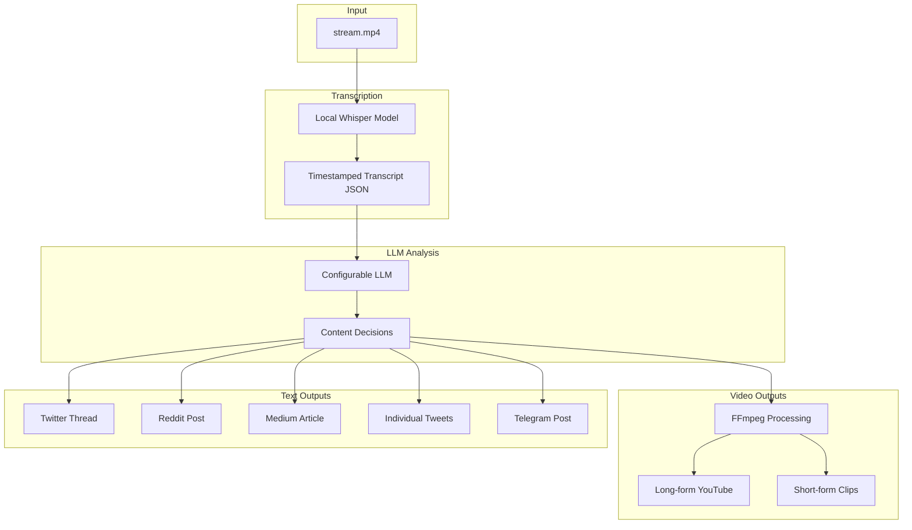

# Stream Repurposing Pipeline

Build a Python pipeline that transcribes stream recordings using local Whisper, analyzes content with a configurable LLM, cuts video segments with FFmpeg, and generates multi-platform text content - all saved to organized output folders.

## Architecture Overview



## Project Structure

```
stream-repurpose/
├── requirements.txt
├── config.yaml              # LLM provider settings, whisper model path
├── main.py                  # Entry point script
├── src/
│   ├── __init__.py
│   ├── transcriber.py       # Whisper transcription with timestamps
│   ├── analyzer.py          # LLM analysis to identify content segments
│   ├── video_processor.py   # FFmpeg video cutting
│   ├── content_generator.py # Text content generation
│   └── llm/
│       ├── __init__.py
│       ├── base.py          # Abstract LLM interface
│       ├── openai_provider.py
│       ├── anthropic_provider.py
│       └── ollama_provider.py
├── prompts/
│   ├── analysis.txt         # Prompt for analyzing transcript
│   ├── twitter_thread.txt
│   ├── reddit_post.txt
│   ├── medium_article.txt
│   └── tweets.txt
├── output/                  # Generated content saved here
│   └── {stream_name}/
│       ├── transcript.json
│       ├── analysis.json
│       ├── videos/
│       │   ├── long_form.mp4
│       │   └── shorts/
│       ├── twitter_thread.md
│       ├── reddit_post.md
│       ├── medium_article.md
│       ├── tweets.md
│       └── telegram_post.md
└── stream-1-raw.mp4         # Input files
```

## Implementation Details

### 1. Transcription Module (`src/transcriber.py`)

- Use `pywhispercpp` to leverage your existing GGML model
- Model path: `/Users/artemlazarev/Library/Application Support/MacWhisper/modelsggml-model-whisper-turbo.bin`
- Output JSON with segment-level timestamps:

```python
{
  "segments": [
    {"start": 0.0, "end": 5.2, "text": "Hey everyone welcome to the stream..."},
    ...
  ]
}
```

- Model path configurable in `config.yaml`

### 2. LLM Provider System (`src/llm/`)

- Abstract base class for swappable providers
- Support OpenAI, Anthropic Claude, and Ollama (local)
- Configuration in `config.yaml`:

```yaml
whisper:
  model_path: "/Users/artemlazarev/Library/Application Support/MacWhisper/modelsggml-model-whisper-turbo.bin"

llm:
  provider: "openai"  # or "anthropic", "ollama"
  model: "gpt-4o"
  api_key_env: "OPENAI_API_KEY"
```

### 3. Analysis Module (`src/analyzer.py`)

- Send transcript to LLM with structured prompt
- LLM returns JSON with:
  - Long-form segments (timestamps for main content)
  - Short-form clips (timestamps for 30-60 second viral moments)
  - Key topics/highlights for text content
  - Suggested titles and hooks

### 4. Video Processor (`src/video_processor.py`)

- Use `ffmpeg-python` or subprocess calls
- Cut segments based on LLM-provided timestamps
- For short-form: add vertical crop (9:16 aspect ratio) option

### 5. Content Generator (`src/content_generator.py`)

- Generate each text format using dedicated prompts
- Pass relevant transcript segments to LLM
- Save as markdown files for easy review/editing

## Key Dependencies

```
pywhispercpp
ffmpeg-python
openai
anthropic
pyyaml
```

## Usage Flow

```bash
# Configure your LLM provider in config.yaml
# Set API key as environment variable

python main.py stream-1-raw.mp4

# Output saved to output/stream-1-raw/
```

## Notes

- Whisper transcription uses your existing GGML turbo model (no download needed)
- FFmpeg must be installed on the system
- All outputs are saved as files for manual review before posting
- Prompts are externalized in `prompts/` folder for easy customization

## Tasks

1. Create project structure, requirements.txt, and config.yaml
2. Implement Whisper transcription module with timestamped output
3. Build LLM provider abstraction (OpenAI, Anthropic, Ollama)
4. Create analysis module to identify content segments via LLM
5. Implement FFmpeg video cutting for long-form and short-form
6. Build text content generators for all platforms
7. Create main.py entry point tying everything together
8. Write prompts for analysis and each content type
