# Stream Repurposing Pipeline

A powerful Python pipeline that automatically transcribes stream recordings, analyzes content with AI, and generates multiple content formats for various platforms. Transform a single stream recording into YouTube videos, Twitter threads, Reddit posts, Medium articles, and more.

## 🚀 Quick Links

- **[QUICKSTART.md](QUICKSTART.md)** - Step-by-step setup guide (start here!)
- **[CHEATSHEET.md](CHEATSHEET.md)** - Quick reference for common commands
- **[FIXES.md](FIXES.md)** - Technical documentation of recent fixes

## 🎯 Overview

This tool takes a stream recording (MP4 video file) and automatically:

1. **Transcribes** the audio using a local Whisper model (no API costs)
2. **Analyzes** the content with an LLM to identify key segments and highlights
3. **Generates** long-form and short-form video clips
4. **Creates** platform-specific text content (Twitter, Reddit, Medium, Telegram, etc.)

All outputs are saved as files for manual review before publishing.

## ✨ Features

- **Local Transcription**: Uses whisper.cpp with Whisper GGML models (no API costs, works offline, Metal GPU acceleration on Apple Silicon)
- **Multi-LLM Support**: Works with OpenAI, Anthropic Claude, or local Ollama
- **Intelligent Content Analysis**: AI identifies valuable segments, viral moments, and key highlights
- **Video Processing**: Automatically creates:
  - Long-form YouTube videos (trimmed to main content)
  - Short-form vertical clips (9:16 aspect ratio for TikTok/Shorts/Reels)
- **Multi-Platform Text Generation**:
  - Twitter threads
  - Individual tweets
  - Reddit posts
  - Medium articles
  - Telegram posts
- **Configurable**: Easy YAML-based configuration
- **Modular Architecture**: Clean, extensible codebase

## 🏗️ Architecture

```mermaid
flowchart TD
    Start([📹 Input MP4 Video]) --> Transcribe[🎤 Whisper Transcription<br/>whisper.cpp CLI + Metal GPU]
    
    Transcribe --> Transcript[(📄 Timestamped Transcript<br/>JSON)]
    
    Transcript --> Analyze[🤖 LLM Analysis<br/>OpenAI/Anthropic/Ollama]
    
    Analyze --> Analysis[(📊 Content Analysis<br/>Segments & Highlights)]
    
    Analysis --> VideoBranch[🎬 Video Processing]
    Analysis --> TextBranch[✍️ Text Generation]
    
    VideoBranch --> FFmpeg[🔧 FFmpeg Processing]
    FFmpeg --> LongForm[📺 Long-form Video<br/>YouTube-ready]
    FFmpeg --> ShortForm[📱 Short Clips<br/>9:16 Vertical Format]
    
    TextBranch --> Twitter[🐦 Twitter Thread]
    TextBranch --> Tweets[💬 Individual Tweets]
    TextBranch --> Reddit[🔴 Reddit Post]
    TextBranch --> Medium[📰 Medium Article]
    TextBranch --> Telegram[💬 Telegram Post]
    
    LongForm --> Output[📁 Output Directory]
    ShortForm --> Output
    Twitter --> Output
    Tweets --> Output
    Reddit --> Output
    Medium --> Output
    Telegram --> Output
    
    Output --> Review[✅ Manual Review<br/>& Publishing]
    
    style Start fill:#e1f5ff,color:#000000
    style Transcribe fill:#fff4e6,color:#000000
    style Analyze fill:#f3e5f5,color:#000000
    style VideoBranch fill:#e8f5e9,color:#000000
    style TextBranch fill:#fff3e0,color:#000000
    style Output fill:#f1f8e9,color:#000000
    style Review fill:#e3f2fd,color:#000000
```



## 📋 Requirements

- Python 3.9+
- FFmpeg (for video processing)
- Xcode Command Line Tools (macOS) or build tools (Linux)
- A Whisper GGML model file
- An LLM API key (OpenAI, Anthropic, or local Ollama)

## 🚀 Installation

### 1. Clone the repository

```bash
git clone <repository-url>
cd stream-repurpose
```

### 2. Create a virtual environment

```bash
python3 -m venv venv
source venv/bin/activate  # On Windows: venv\Scripts\activate
```

### 3. Install dependencies

```bash
pip install -r requirements.txt
```

### 4. Install FFmpeg

**macOS:**
```bash
brew install ffmpeg
```

**Linux (Ubuntu/Debian):**
```bash
sudo apt-get install ffmpeg
```

**Windows:**
Download from [ffmpeg.org](https://ffmpeg.org/download.html) or use `choco install ffmpeg`

### 5. Build whisper.cpp

The transcription uses whisper.cpp directly for maximum reliability and performance. Build it using CMake:

```bash
# Clone whisper.cpp into vendor directory
mkdir -p vendor
cd vendor
git clone https://github.com/ggerganov/whisper.cpp
cd whisper.cpp

# Build using CMake (recommended)
cmake -B build
cmake --build build -j --config Release

# Verify the build
ls -la build/bin/whisper-cli
```

**Note**: The pipeline automatically disables Metal GPU acceleration due to buffer allocation issues on some systems. CPU-based transcription using Accelerate framework is fast and reliable on Apple Silicon.

### 6. Get a Whisper Model

You need a Whisper GGML model file. Download one from:

- [MacWhisper](https://goodsnooze.gumroad.com/l/macwhisper) models
- Or use whisper.cpp's download script:
  ```bash
  cd vendor/whisper.cpp
  ./models/download-ggml-model.sh base.en
  # or: ./models/download-ggml-model.sh medium
  # or: ./models/download-ggml-model.sh large-v3
  ```

Then update the `model_path` in `config.yaml` to point to your model file.

## ⚙️ Configuration

Edit `config.yaml` to configure the pipeline:

```yaml
whisper:
  model_path: "/path/to/your/ggml-model-whisper-turbo.bin"
  whisper_cpp_path: "vendor/whisper.cpp"  # Path to whisper.cpp repository

llm:
  provider: "openai"  # Options: "openai", "anthropic", "ollama"
  model: "gpt-4o"
  api_key_env: "OPENAI_API_KEY"  # Environment variable name

output:
  base_dir: "output"

video:
  short_form:
    min_duration: 30  # seconds
    max_duration: 60  # seconds
    aspect_ratio: "9:16"
```

### Setting up API Keys

**For OpenAI:**
```bash
export OPENAI_API_KEY="your-api-key-here"
```

**For Anthropic:**
```bash
export ANTHROPIC_API_KEY="your-api-key-here"
```

**For Ollama (local):**
- Install Ollama from [ollama.ai](https://ollama.ai)
- Run `ollama pull llama3` (or your preferred model)
- No API key needed

⚠️ **CRITICAL SECURITY WARNING**: 
- **NEVER commit API keys to your repository**
- Always use environment variables (as shown above)
- The `config.yaml` file should reference environment variable names, not actual keys
- If you accidentally commit a key, rotate it immediately in your provider's dashboard
- Consider using a `.env` file with `python-dotenv` for local development (and add `.env` to `.gitignore`)

## 📖 Usage

### Quick Start - Transcription Only

If you just want to transcribe a video without running the LLM analysis or generating content:

1. **Activate your virtual environment:**
   ```bash
   source venv/bin/activate  # On Windows: venv\Scripts\activate
   ```

2. **Run transcription only:**
   ```bash
   python main.py your-video.mp4 --skip-video --skip-text
   ```

This will:
- Automatically convert MP4/video files to WAV format (required by whisper.cpp)
- Transcribe using whisper.cpp (CPU-only for stability)
- Save transcript to `output/your-video/transcript.json`
- Skip LLM analysis, video processing, and text generation

### Quick Start - Full Pipeline

1. **Activate your virtual environment:**
   ```bash
   source venv/bin/activate  # On Windows: venv\Scripts\activate
   ```

2. **Set your LLM API key:**
   ```bash
   export OPENAI_API_KEY="your-api-key-here"
   # Or for Anthropic:
   # export ANTHROPIC_API_KEY="your-api-key-here"
   ```

3. **Run the full pipeline:**
   ```bash
   python main.py stream-1-raw.mp4
   ```

### What Happens

The pipeline automatically:
1. **Transcribes** the video using whisper.cpp (with Metal GPU acceleration on Apple Silicon)
2. **Analyzes** the transcript with the LLM to identify key segments and highlights
3. **Generates** video clips (long-form and short-form vertical clips)
4. **Creates** all text content formats (Twitter, Reddit, Medium, Telegram, etc.)

All outputs are saved to `output/{stream_name}/` for review before publishing.

### Advanced Options

```bash
# Skip video processing (faster for testing)
python main.py stream-1-raw.mp4 --skip-video

# Skip text generation
python main.py stream-1-raw.mp4 --skip-text

# Skip transcription (use existing transcript.json)
python main.py stream-1-raw.mp4 --skip-transcription

# Use a custom config file
python main.py stream-1-raw.mp4 --config custom-config.yaml
```

### Output Structure

After processing, you'll find all outputs in `output/{stream_name}/`:

```
output/
└── stream-1-raw/
    ├── transcript.json          # Timestamped transcript
    ├── analysis.json            # LLM analysis with segments
    ├── videos/
    │   ├── long_form.mp4        # Main content video
    │   └── shorts/
    │       ├── short_01.mp4     # Vertical clips
    │       ├── short_02.mp4
    │       └── ...
    ├── twitter_thread.md        # Twitter thread
    ├── tweets.md                # Individual tweets
    ├── reddit_post.md           # Reddit post
    ├── medium_article.md        # Medium article
    └── telegram_post.md        # Telegram post
```

## 🎨 Customizing Prompts

All prompts are stored in the `prompts/` directory and can be customized:

- `analysis.txt` - Prompt for analyzing the transcript
- `twitter_thread.txt` - Twitter thread generation
- `tweets.txt` - Individual tweets
- `reddit_post.txt` - Reddit post format
- `medium_article.txt` - Medium article format
- `telegram_post.txt` - Telegram post format

Edit these files to change the tone, style, or format of generated content.

## 🔧 Project Structure

```
stream-repurpose/
├── main.py                  # Entry point
├── config.yaml              # Configuration file
├── requirements.txt         # Python dependencies
├── src/
│   ├── transcriber.py       # Whisper transcription
│   ├── analyzer.py          # LLM analysis
│   ├── video_processor.py   # FFmpeg video processing
│   ├── content_generator.py # Text content generation
│   └── llm/
│       ├── base.py          # Abstract LLM interface
│       ├── openai_provider.py
│       ├── anthropic_provider.py
│       └── ollama_provider.py
├── prompts/                 # Prompt templates
└── output/                  # Generated content
```

## 🐛 Troubleshooting

### Transcription Issues

**Problem**: whisper-cli not found or build directory doesn't exist
- **Solution**: Build whisper.cpp using CMake (not make):
  ```bash
  cd vendor/whisper.cpp
  cmake -B build
  cmake --build build -j --config Release
  ```
- **Check**: Verify `vendor/whisper.cpp/build/bin/whisper-cli` exists

**Problem**: Segmentation fault (exit code 139) or Metal buffer allocation error
- **Symptoms**: 
  - `ggml_metal_buffer_init: error: failed to allocate buffer`
  - Process crashes with SIGSEGV
- **Solution**: This is automatically handled! The transcriber now:
  - Disables GPU acceleration (uses `--no-gpu` flag)
  - Runs on CPU with Accelerate framework (still very fast on Apple Silicon)
- **Manual Test**: You can test whisper-cli directly:
  ```bash
  # This should work now:
  vendor/whisper.cpp/build/bin/whisper-cli \
    -m vendor/whisper.cpp/models/for-tests-ggml-tiny.bin \
    -f vendor/whisper.cpp/samples/jfk.wav \
    --no-gpu
  ```

**Problem**: Input file format not supported
- **Solution**: The pipeline now automatically converts MP4 and other formats to WAV
- **Details**: whisper-cli only supports 16-bit WAV files at 16kHz mono
- **Manual Conversion** (if needed):
  ```bash
  ffmpeg -i input.mp4 -ar 16000 -ac 1 -c:a pcm_s16le output.wav
  ```

**Problem**: Model fails to load
- **Solution**: Check that the model path in `config.yaml` is correct and the file exists
- **Verify**: The config should point to a valid GGML model file:
  ```yaml
  whisper:
    model_path: "/path/to/ggml-model-whisper-turbo.bin"
  ```

**Problem**: Build errors on macOS
- **Solution**: Make sure Xcode Command Line Tools are installed:
  ```bash
  xcode-select --install
  ```

**Problem**: Python dependencies missing
- **Solution**: Make sure you've installed all requirements:
  ```bash
  source venv/bin/activate
  pip install -r requirements.txt
  ```

### LLM API Issues

**Problem**: API key not found
- **Solution**: Make sure you've set the environment variable:
  ```bash
  export OPENAI_API_KEY="your-key"
  ```

**Problem**: Rate limits or API errors
- **Solution**: The pipeline will show the error. Check your API key and account limits.

### Video Processing Issues

**Problem**: FFmpeg not found
- **Solution**: Install FFmpeg (see Installation section)

**Problem**: Video processing fails
- **Solution**: Check that the input video file is valid and not corrupted

## 📝 Example Workflow

1. **Record your stream** → Save as `my-stream.mp4`

2. **Configure the pipeline**:
   ```bash
   # Set your API key
   export OPENAI_API_KEY="sk-..."
   
   # Edit config.yaml if needed
   ```

3. **Run the pipeline**:
   ```bash
   python main.py my-stream.mp4
   ```

4. **Review outputs** in `output/my-stream/`

5. **Edit and publish** the generated content

## 🤝 Contributing

Contributions are welcome! Please feel free to submit a Pull Request.

## 🔒 Security Best Practices

1. **Never commit API keys** - Always use environment variables
2. **Use `.gitignore`** - The repository includes a `.gitignore` file to prevent committing sensitive data
3. **Rotate keys if exposed** - If you accidentally commit a key, rotate it immediately
4. **Use separate keys for development** - Don't use production API keys for testing

## 📄 License

MIT

## 🙏 Acknowledgments

- [whisper.cpp](https://github.com/ggerganov/whisper.cpp) - C++ implementation of Whisper with Metal GPU acceleration
- OpenAI for Whisper and GPT models
- Anthropic for Claude models

## 📧 Support

For issues, questions, or contributions, please open an issue on GitHub.

---

**Made with ❤️ for content creators**
